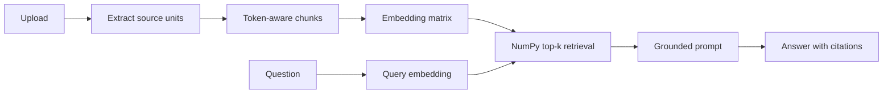

# AI Study Assistant Chatbot

A citation-grounded, multi-document RAG application that lets students upload
course materials, generate summaries, and ask questions answered from retrieved
pages, slides, paragraphs, and line ranges.


## Key capabilities

- Ingests PDF, PPTX, DOCX, and TXT files with source-level locations.
- Retains the original reading-material and homework summary experience.
- Splits text into deterministic, overlapping, token-aware chunks.
- Batches OpenAI embeddings and ranks normalized vectors with NumPy.
- Searches across all documents in the current course.
- Answers only from retrieved passages with validated `[1]`, `[2]` citations.
- Displays authoritative filenames, locations, excerpts, and retrieval scores.
- Uses an exact refusal when uploaded materials do not support an answer.
- Treats instructions inside uploaded documents as untrusted content.
- Avoids duplicate upload processing within the current session.
- Compares RAG with the original summary/context-stuffing strategy.
- Runs automated tests without paid API calls.

## Architecture



The application remains a single Streamlit process. `ingest.py` handles pure
file processing, `retrieve.py` owns embeddings and vector search, and `llm.py`
isolates model calls, prompts, retries, usage metadata, and citation validation.
This separation keeps external calls mockable and the retrieval logic easy to
explain.

## Retrieval and citation design

Each extracted `SourceUnit` represents one PDF page, PowerPoint slide, DOCX
paragraph, or TXT line range. Units are independently split at token boundaries
using 600-token chunks with 100-token overlap. A chunk ID is a deterministic
SHA-256 hash of its source metadata and normalized text.

Document embeddings are created in batches, converted to `float32`, and
L2-normalized. Query vectors use the same normalization, so NumPy dot products
produce cosine-similarity rankings:

```python
scores = embeddings @ query_embedding
top_indices = np.argsort(-scores, kind="stable")[:top_k]
```

Only the top retrieved passages, the current question, course name, and bounded
recent history reach the answer model. Uploaded passages are explicitly marked
as untrusted reference data. Citation numbers are range-checked after generation,
while the UI derives displayed filenames and locations from retrieval metadata
rather than model-written text.

## Evaluation methodology

The committed corpus contains four original, redistribution-safe fixtures—one
per supported file format—and a manually curated 30-question golden set:

- 20 single-source answerable questions
- 5 multi-source answerable questions
- 5 unanswerable questions

The runner builds document embeddings once, then executes either the previous
summary/context-stuffing baseline, production RAG, or both. It reports:

- Recall@1, Recall@3, and Recall@4
- Deterministic reference-answer match
- Citation validity and exact source accuracy
- Refusal accuracy and false-refusal rate
- API-reported prompt and total tokens
- End-to-end latency
- Supplemental LLM-judge correctness, groundedness, and relevance

The judge sees only the question, concise reference answer, evidence excerpts,
and generated answer—not entire documents. Its JSON scores are validated and
fail closed after at most one repair attempt.

## Measured results

The 2026-07-28 API run shows that RAG retrieved an accepted source in the first
result for every answerable question, produced valid and source-accurate
citations for every answered question, and correctly handled every answerable
and unanswerable case. It reduced mean input tokens by 35.0% versus stuffing.

| Metric | Stuffing | RAG |
|---|---:|---:|
| Recall@4 | N/A | 100.0% |
| Deterministic answer match | 53.3% | 96.7% |
| Citation source accuracy | N/A | 100.0% |
| Refusal accuracy | 100.0% | 100.0% |
| False-refusal rate | 12.0% | 0.0% |
| Mean input tokens | 700.2 | 455.3 |
| Supplemental judge scores | N/A | 100.0% |

The remaining RAG deterministic-match miss is a lexical-metric artifact: the
generated answer correctly describes separate chaining with citations but uses
different wording from the concise reference. See
[`eval/results.md`](eval/results.md) for the full configuration, latency,
failure examples, and limitations. Values are generated by the real API
evaluation command, never estimated.

## Installation

Python 3.11 or newer is recommended.

```bash
python -m venv .venv
```

Activate the environment:

```powershell
.venv\Scripts\Activate.ps1
```

```bash
source .venv/bin/activate
```

Install pinned dependencies:

```bash
python -m pip install --upgrade pip
python -m pip install -r requirements.txt
```

## Configuration

Copy `.env.example` to `.env` and add a project-scoped OpenAI API key:

```dotenv
OPENAI_API_KEY=
OPENAI_CHAT_MODEL=gpt-5.6-terra
OPENAI_EMBEDDING_MODEL=text-embedding-3-small
```

Optional environment overrides include `CHUNK_SIZE_TOKENS`,
`CHUNK_OVERLAP_TOKENS`, `RETRIEVAL_TOP_K`, `EMBEDDING_BATCH_SIZE`,
`RECENT_MESSAGE_LIMIT`, and `REQUEST_TIMEOUT_SECONDS`.

Never commit `.env` or `.streamlit/secrets.toml`. Uploaded text is sent to the
configured OpenAI embedding and generation APIs.

## Running the app

```bash
streamlit run app.py
```

Enter a course name, select a material type, upload one or more documents, and
choose **Process uploads**. Summaries appear under **Materials & summaries**;
cross-document questions belong in **Grounded chat**.

## Running tests

```bash
pytest -q
```

Tests use synthetic vectors and mocked model clients. They do not require an API
key and do not make paid calls.

## Running evaluation

Run both strategies and write Markdown plus detailed JSON:

```bash
python -m eval.run_eval \
  --mode both \
  --golden-set eval/golden_set.json \
  --output eval/results.md \
  --output-json eval/results.json
```

Useful development flags:

```text
--mode stuffing|rag|both
--top-k 4
--limit 5
--ids q024 q025
--resume-json eval/results.json
--workers 1
--skip-judge
--documents-dir eval/fixtures
```

Use `--ids` with `--resume-json` to rerun selected cases and merge them into a
prior JSON result set without paying to repeat the complete evaluation.

`eval/results.json` is ignored because detailed answers may contain document
content. The aggregate Markdown report is committed.

## Project structure

```text
.
├── app.py
├── config.py
├── ingest.py
├── retrieve.py
├── llm.py
├── requirements.txt
├── eval/
│   ├── build_fixtures.py
│   ├── fixtures/
│   ├── golden_set.json
│   ├── judge.py
│   ├── run_eval.py
│   └── results.md
├── tests/
└── .github/workflows/tests.yml
```

## Limitations

- Extraction is text-only; image-only PDFs and text inside images need OCR.
- Retrieval quality depends on the embedding model and chunk boundaries.
- Model answers can still be wrong despite grounding instructions.
- Citation structure and source matching do not guarantee entailment.
- The evaluation corpus is intentionally small and synthetic.
- Documents and chat remain session-only; refreshing Streamlit clears them.
- The default index is an in-memory NumPy matrix, appropriate for a lightweight
  interview-scale project rather than a large production corpus.

## Future work

Only measured needs should expand this design. Plausible next steps are optional
SQLite persistence, better evaluation data from legally shareable real courses,
and streaming that preserves citation validation and usage accounting.
